# 🏭Candy-Distribution_SQL🍭


Table of Contents 📑

## 📌 About the Project
This project explores a real-world dataset about the US candy industry. We uploaded the CSV files into VS Code, created a PostgreSQL database, and established a connection between them. Also we build a clean database foundation and prepare the data to answer key business questions about candy sales, factory efficiency, and regional trends.

---
## 🎯 Objectives
In this project, our main objectives are:

- ✅ Understand and structure the US Candy sales data.  
- ✅ Solve real business problems by identifying profitable products, comparing sales to targets, and providing advanced data analysis.
- ✅ Explore seasonality and regional trends in candy sales.  
- ✅ Compare product performance against division targets.  
- ✅ Build a maintainable, clean database schema with a clear ER diagram.
- ✅ Uncover data trends and hidden insights using advanced SQL techniques.
---

## 🗂️ Data Source & Context
**_Source👉_**: [**Maven Analytics “US Candy Distributor”**](https://www.mavenanalytics.io/data-playground?order=date_added%2Cdesc&search=candy%20distributor)


**Why This Candy Dataset?**
 
- **Balanced Size:** Ideal for both complex SQL queries and rapid iteration.
- **Geospatial & Time Series Data:** Includes latitude/longitude coordinates, order dates, and shipping information, ideal for joins, distance calculations, and time-based analyses.
- **Business Relevance:** SKU-level sales data, factory origins, customer locations, and division targets mirror real-world retail/distribution analytics scenarios.
- **Well-Organised CSV Files:** Multiple files represent distinct tables in a relational model.


_**Here is a short description for each CSV file & its columns**_:

1.**Sales.csv**  
   - **Columns**: `row_id`, `order_id`, `order_date`, `ship_date`, `customer_id`,  
     `division`, `product_id`, `units`, `gross_profit`, `cost`, etc.  
   - **Describes**: Individual sales transactions linking customers, products, and financials.

2.  **Factories.csv**  
   - **Columns**: `factory_name`, `latitude`, `longitude`  
   - **Describes**: Candy factory names and their geographic locations.

3. **Targets.csv**  
   - **Columns**: `division`, `Target_Count`  
   - **Describes**: Sales targets for each division (Chocolate, Sugar, Other).

4.  **Products.csv**  
   - **Columns**: `product_id`, `product_name`, `division`, `factory_name`, `unit_cost`, `unit_price`  
   - **Describes**:  type of candy and  its division, factory origin, and cost/price.

5. **us_zips.csv**  
   - **Columns**: `zip`, `lat`, `lng`, `city`, `state_id`, `state_name`,  
     `zcta`, `population`, `density`, `county_fips`, `county_name`, `timezone`  
   - **Describes**: ZIP-level geographic and demographic data for mapping customers.

6. **Dictionary.csv**
   
    _Lists descriptions for the tables & their columns._

---  dinner

> **_Now let's move into the deep work🕵️‍♂️_**

## 📑 Phase 1: Business & Data Understanding
- ✅ **Created** the PostgreSQL database and defined tables matching our CSV structures.  
- ✅ **Uploaded** CSV data into those tables using VS Code’s SQL editor.
- ✅ Verified row counts for each table matched CSV sources.  
- 🧹 Dropped unused columns from `us_zips` to keep only zip, zcta, state, county, population, density, timezone.   
- ✅ **Clarified** the business questions we’ll answer by analysing our dataset:

 **General Questions**

1. Which product divisions & individual SKUs drive our profits?
2. Which product divisions and SKUs move the most units? 
3. Which shipping routes are the most expensive?

**Geographic & Optimization**

1. Which customer–factory pairs are least efficient (long distance + low margin)?  
2. Which geographic regions deliver the highest return on sales (ROS)?

**Time-Based Trends**

1. How do monthly/quarterly sales trends look?  
2. Which weekdays vs weekends drive the most orders and profit?

**Advanced Questions**

1.Who are our highest–lifetime–value customers, and how do they ship?
2.How has gross profit for each product division evolved year-over-year?
3. Which product lines should be moved to a different factory to optimize shipping routes?
   


### 🔗 ERD Diagram
    FACTORIES ||--o{ PRODUCTS       : factory_name
    TARGETS   ||--o{ PRODUCTS       : division
    TARGETS   ||--o{ SALES          : division
    PRODUCTS  ||--o{ SALES          : product_id
    US_ZIPS   ||--o{ SALES          : postal_code


### ERD Explained

- **FACTORIES → PRODUCTS** (`products.factory_name` → `factories.factory_name`)  
  One factory can produce many products.

- **TARGETS → PRODUCTS** (`products.division` → `targets.division`)  
  Each product belongs to a division that has a sales target.

- **TARGETS → SALES** (`sales.division` → `targets.division`)  
  Each sale is classified under a division with an associated target.

- **PRODUCTS → SALES** (`sales.product_id` → `products.product_id`)  
  A product can appear in many sales records.

- **US_ZIPS → SALES** (`sales.postal_code` → `us_zips.zip`)  
  Each sale’s customer ZIP links to geographic data.


---

## 🛠️ Tools Used

- **PostgreSQL** – Relational database for storing and querying data.  
- **VS Code** – IDE for writing SQL, managing CSVs, and connecting to the database.  
- **Git & GitHub** – Version control and documentation of the entire process.  
- **Sider AI** –  Explored multiple AI models for the data analysis journey. 
- **DeepSeek** – Automated code review & best-practice suggestions.  
- **Perplexity** – Contextual search for technical guidance & fact-checking.
- **GPT**–  Drafted and refined narrative content
- **Grammarly** – Writing assistant to polish documentation.  

---
 
# **Phase:** 2 of 3  🧹 Data Cleaning & Preparation 
 

## 🔍 Overview

During **Phase 2**, we cleaned and prepared 5 core tables:

- **`factories`**  
- **`targets`**  
- **`products`**  
- **`us_zips`**  
- **`sales`**

For each table, we:

1. **✅Validated Data Types & Removed Nulls / Invalid Values**  
2. **✂️Trimmed Whitespace & Normalized text casing**  
3. **📏 Checked ranges for numeric & date columns**  
4. **🔍 Ensured uniqueness & removed duplicates**  
5. **🔗 Enforced foreign key integrity relationships**  
6. **⚡ Created indexes to boost query performance**

---

## ✨ Data Spa Treatment  
### 📝 Text Columns  
- Identified and resolved missing values like hidden chocolate 🍫
- Removed extra spaces from all text fields ✂️ 
- Standardized capitalization — no more SHOUTING or whispering 🗣️

### 🔢 Numeric Columns  
- Eliminated negative values🚫
- ⚖️ erified geographic coordinates: Confirmed coordinates were Earth-bound 🌍 and prices validity ≥ $0
-🚩Flagged unusual values for review 

### 📅 Date Columns  
- Removed time-traveling shipments (1930s orders? Not happening!)
- Ensured logical date sequences (ship after order)   
- Flagged unrealistic dates (like candy deliveries from the year 3000 🚀) 

### ✔️ Boolean Columns  
- Replaced ambiguous entries with clear TRUE/FALSE values  
- Verified categorical consistency

---

## 🧩 Table-by-Table Transformation  

### 🏭 Factories Table  
- 🏷️ Standardized naming conventions  ("sweet FACTORY" → "Sweet Factory")
- 🌎 Validated geographic coordinates 
- 🔑 Ensured each factory had a unique ID 

### 🎯 Targets Table  
- 📊Cleaned division names 
- 🎯 Validated targets to ensure all values were ≥ $0
- 🚫Eliminated duplicate divisions  — one division, one target

### 🍬 Products Table  
- 🆔 **Standardized product IDs** ("choc-123" → "CHOC-123")
- 💰 **Flagged invalid pricing** (no negative costs!) 
- 🤝 **Fixed foreign keys** — every product matched to a valid factory and division

### 📮 US Zips Table  
-**🗺️ Standardized geographic names** ("nEw yOrk" → "New York")
- **🧮 Verified population densities** were realistic
- 👪 **Fixed parent-child** ZIP relationships where needed

### 💰 Sales Table  
- 🕰️ **Removed 1930 shipments** that broke the space-time continuum
- 📦 **Added delivery  time metrics** -  delivery days + delivery categories  (Q1, Q2, Q3, Q4)  
- 💸**Flagged financial inconsistencies** (negative profits? Free candy?)  
- 🚢 **Cleaned up shipping modes** — removed invalid entries like "Same Day"
  
  ## 🕰️ Special Case: 1930 Shipments  
**The Mystery:**Some orders claimed to ship _before_ they were placed!
**Findings:**  
- 📅  56 records dated to 1930  
- 🕰️ Ship dates < order dates  
**Resolution:**  
- 🗑️ Deleted all impossible records
- 🔍 Implemented delivery metrics to prevent similar issues in the future
**Why?** Like stale candy, bad data spoils everything!  

---

## 🔗 Relationship Counseling (Foreign Keys)  
We resolved the connectivity between related tables:
-  **🛟 Rescued 427 sales** linked to missing products
- **📬 Repaired ZIP code gaps**
-  **🏷️ Ensured all products matched to valid division**
- **Reconnected orphaned data entries to their parent tables**.
> *"Like matching candy to wrappers - every piece belongs somewhere!"*  
---

## ⚡ Performance Optimization 
**Added 15 critical indexes to improve query speed**  
- **⏱️ Dramatically improved query speed for future deep analysis** 
- **🐢→⚡Transformed slow operations**  

> *Without indexes, queries crawl like caramel spills... 🐌
---

## 🎉 Results
_After our data spa care, we_: 
- 🪥 Scrubbed 10,000+  fields  
- 🔗 Repaired 427 relationships 
- 🚀 Added 15 performance-boosting indexes
- 🗑️ 56 invalid records removed 

 **_Our data is now_**:
✅ Consistent
✅ Relational
✅ Analysis-Ready 

 
> *"Clean data is like premium chocolate — pure, smooth, and deeply  satisfying!"** 

---
➡️ Next Steps: Analysis Phase!
With our dataset cleaned and polished, we’re ready to:

- 🍫 Uncover regional sales trends
- 📈  Identify top-performing products
- 🚚 Optimize delivery operations
- 🎯 Evaluate sales target performance

  **Let the sweet insights flow!** 🍬✨

---

# **Phase:** 3 of 3  EDA & Advanced Analysis

## 🧠 SQL_Skills_Used

- **Joins** across multiple tables  
- **CASE** statements for conditional logic  
- **Common Table Expressions (CTEs)** for modular queries  
- **Window Functions** for running totals and rankings  
- **Date/Time Functions** for extracting ,months & quarters  
- **Query Optimization** with indexes and EXPLAIN  

---

## 🏁 Big Picture Analysis

**Business Question:**  
> *What is our overall sales and profit profile, and how is profit distributed across order sizes?*

---

### ❓ Why This Matters
- ✅ **Benchmarking:** _Sets the stage_ for the next deeper analyses by revealing whether we’re operating on thin margins or enjoying healthy per-order returns.  
- ✅ **Risk Identification:** Exposes reliance on low-profit orders—critical for assessing if fulfillment and shipping costs might be eating into our bottom line.  
- ✅ **Strategic Focus:** Highlights whether we need to prioritize **volume growth**, **value extraction** (upsells), or **cost-control** measures before tackling more granular questions.
----
```sql
--Simple Aggregate & basic summary statistics

SELECT
 count(*)  AS num_orders,
 Sum(total_sales) AS total_sales,
 sum(gross_profit) AS total_profit,
ROUND(AVG(total_sales), 2) AS avg_sales_per_Order,
ROUND(AVG(gross_profit), 2) AS avg_profit_per_Order
    FROM
        sales
```
Here is the result:

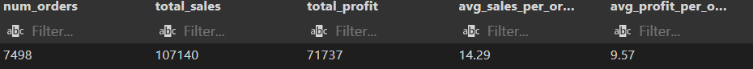

```sql
--Bucketed Profit Distribution

WITH profit_buckets AS (
  SELECT
    gross_profit,
    CASE
      WHEN gross_profit < 50   THEN '$0–$50'
      WHEN gross_profit < 100  THEN '$50–$100'
      WHEN gross_profit < 200  THEN '$100–$200'
      ELSE '$200+' 
    END AS bucket_label
  FROM sales
)
SELECT
  bucket_label,
  COUNT(*)                AS num_orders,
  SUM(gross_profit)       AS bucket_total_profit,
  ROUND(100.0 * COUNT(*) / SUM(COUNT(*)) OVER (), 2) AS pct_of_orders
FROM profit_buckets
GROUP BY bucket_label
ORDER BY
  CASE 
    WHEN bucket_label = '$0–$50'   THEN 1
    WHEN bucket_label = '$50–$100' THEN 2
    WHEN bucket_label = '$100–200' THEN 3

    ELSE 4
  END;
```
Output
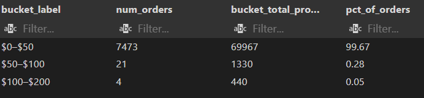

### 💡 Key Insights
- **High Volume of Low-Profit Orders**  
  - 99.7 % of orders generate **<$50** profit, yet these make up ~97.5 % of total transactions.  
- **Thin Margins per Order**  
  - Average profit per order is only **\$9.57**, while average sales are **\$14.29**—indicating small order sizes and tight margins.  
- **Few High-Profit Outliers**  
  - Orders above **\$50** profit are vanishingly rare (< 0.5 %), suggesting limited upsell or bulk-order activity.

### 🚀 Data-Driven Decisions
- **Boost Average Order Value**  
  - Introduce *bundle deals* or tiered free-shipping thresholds (e.g., free ship over **\$30**) to push more orders into higher-profit buckets.  
- **Targeted Promotions**  
  - Identify frequent low-profit customers and offer *“add-on”* suggestions at checkout (e.g., “Add one more item for **\$5 off**”).  
- **Loyalty & Subscription Programs**  
  - Encourage repeat purchases with subscription bundles that guarantee higher per-order profit and predictable revenue.  
- **Cost Analytics**  
  - Model the true cost (shipping + handling) versus the **\$9.57** average profit to ensure each order remains profitable. Flag any “break-even” ZIPs.  
- **Upsell High-Margin SKUs**  
  - Analyze product mix to promote items with **>\$50** profit potential; feature these in emails, on-site banners, and during checkout.

 **General Questions**

1.“Which product divisions & individual SKUs drive our profits?”

```sql
-- (Category)- Level Profit Query

SELECT
  division,
  SUM(total_sales)   AS total_sales,
  SUM(gross_profit)  AS total_profit
FROM 
      sales 
GROUP BY 
      division
ORDER BY 
    total_profit DESC;
```

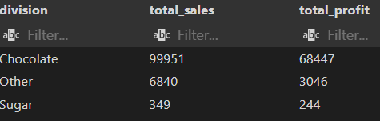

```sql 
--Product‐Level Profit Query

SELECT
  p.product_id,
  p.product_name,
  SUM(s.total_sales)  AS total_sales,
  SUM(s.gross_profit) AS total_profit
 FROM 
      sales s
JOIN 
  products p
ON s.product_id = p.product_id
GROUP BY
   p.product_id, p.product_name
ORDER BY 
  total_profit DESC
LIMIT 10;
```
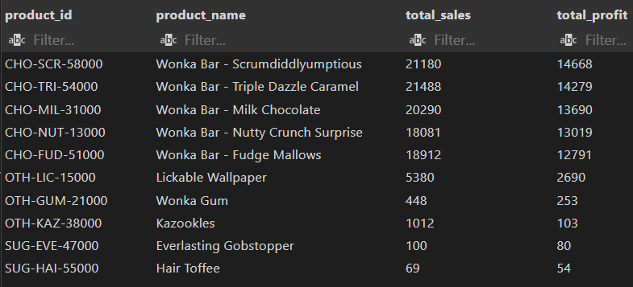
### 💡 Key Insights  
- **Dominant Chocolate Division** 🚀  
  Nearly all profit stems from classic Wonka Bar variants.  
- **Concentration Risk** ⚠️  
  Over-reliance on five SKUs could expose us to supply or pricing shocks.  
- **Underleveraged Niches** 🌱  
  “Other” category items like Lickable Wallpaper show potential for targeted marketing.  
- **Weak Sugar Performance** 📉  
  Sugar division’s low volume and profit suggest low demand or margin pressure.

---
 🚀 Data Driven Decisions
### 🚀 Data-Driven Decisions  
- **Double-Down on Wonka Bars** 🍫  
  Launch limited-edition flavors and bundle packs to capitalize on top sellers.  
- **Mitigate Concentration Risk** 🔄  
  Develop or acquire new high-margin chocolate variants to diversify the hero lineup.  
- **Boost “Other” Niche SKUs** 🎨  
  Feature quirky items in social campaigns (e.g., “Taste the Wall!”) to grow impulse buys.  
- **Revitalize Sugar Division** 🍬  
  Evaluate pricing, packaging, or formulation changes for Gobstopper & Toffee, or consider sunsetting low-performers.  
- **Inventory & Production Alignment** 🏭  
  Prioritize factory capacity and raw-material procurement for top-profit SKUs to avoid stockouts.
  
2. Which product divisions and SKUs move the most units?
 
### ❓ Why It Matters
- 📦 **Inventory Planning:** Ensures high-turnover items are always in stock.  
- 🚚 **Logistics & Fulfillment:** Prioritizes fast movers in warehouse layout and pick-pack workflows.  
- 🎯 **Marketing Focus:** Guides promotional efforts toward popular products to maximize volume-driven growth.
- Reveals where customer demand is strongest in terms of quantity, not just revenue or profit.
```sql
-- Top_Selling_Categories_by_Quantity
SELECT
  division,
  SUM(units) AS total_units_sold
FROM 
  sales 
GROUP BY
   division
ORDER BY
   total_units_sold DESC;
```
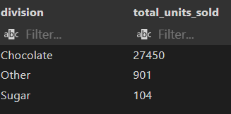

```sql
-- Top_Selling_Products_by_Quantity

SELECT
  p.product_id,
  p.product_name,
  SUM(s.units) AS total_units_sold
 FROM 
  sales s
JOIN products p 
ON s.product_id = p.product_id
GROUP BY 
    p.product_name, p.product_id
ORDER BY
     total_units_sold DESC
LIMIT 9;
```
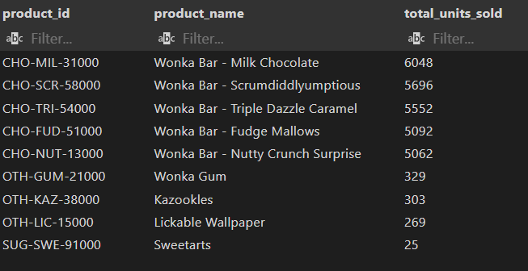
### 💡 Key Insights
- **Volume Concentration** 🍫  
  *Top 5 SKUs are all Wonka Bars, each selling >5,000 units—critical to keep fully stocked.*  
- **Secondary Niches** 🌟  
  *“Other” novelties (Gum, Kazookles, Wallpaper) have loyal but small followings.*  
- **Underperforming Sugar** 📉  
  *Sugar division’s low unit counts indicate market gaps or promotional neglect.*

---

### 🚀 Data-Driven Decisions
- **Optimize Inventory for Wonka Bars** 📈  
  Increase safety stock levels and forecast demand spikes (holidays, promotions).  
- **Feature Novelties Strategically** 🤝  
  Bundle Gum or Kazookles with top-selling bars to boost cross-sell and upsell volume.  
- **Revitalize Sugar Lineup** 🍬  
  Run targeted promotions for Sugar SKUs (e.g., *“Buy 2 Sweetarts, get 1 free”*) to test demand.  
- **Warehouse Prioritization** 🏭  
  Place fast movers (top 5 bars) in the most accessible picking zones to reduce fulfillment time.  
- **Promotional Calendar** 📆  
  Time discounts on mid-week slump days (Tuesday–Thursday) for high-volume bars to flatten demand curves.  

3. Which shipping routes are the most expensive?

Meaning: “Which factory → customer ZIP routes incur the highest shipping costs?”

Importance:

🚚 Cost Control: Pinpoints the “hot spots” in our shipping network that erode margins.

🔍 Route Optimization: Guides decisions on rerouting, carrier negotiations, or local stocking.

📦 Service Strategy: Balances service levels against cost—for example, offering premium vs. economy options.
   
```sql
 -- 1. Map every product_id to its factory
WITH
  factory_loc AS (
    SELECT
      p.product_id,
      f.factory_name
    FROM products p
    JOIN factories f
      ON p.factory_name = f.factory_name
  ),
 
  -- 2. Map every ZIP to its city/state & postal code
  customer_loc AS (
    SELECT
     u.zip               AS customer_zip,
     u.city              AS customer_city,
     u.state_name        AS customer_state,
     s.postal_code AS zip
    FROM
       us_zips u
    JOIN sales s
      ON u.zip = s.postal_code
  ),
 

  -- 3. Build a sales view with origin & destination 
  sales_routes AS (
    SELECT
      s.row_id,
      fl.factory_name          AS factory,
      cl.zip                 AS customer_zip,
      cl.city                 AS customer_city,
      cl.state_name             AS customer_state,
      s.cost                   AS shipping_cost
    FROM sales s
    JOIN products p
      ON s.product_id = p.product_id
    JOIN factories fl
      on p.factory_name = fl.factory_name
    JOIN us_zips cl
      ON s.postal_code = cl.zip
  )

SELECT
  factory,
  customer_zip,  
    SUM(shipping_cost)     AS total_shipping_cost,
  COUNT(*)          AS num_orders,
  ROUND(AVG(shipping_cost), 2) AS avg_cost_per_order,
   customer_state,
  customer_city
    
FROM sales_routes
GROUP BY
  factory,
  customer_zip,
  customer_city,
  customer_state
ORDER BY
  total_shipping_cost DESC
LIMIT 10;
``` 
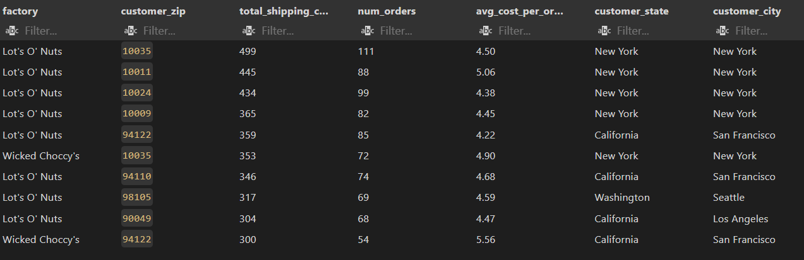

 💡 Key Insights
NYC Dominance (📍 New York, NY):

Four of the top five routes originate from Lot’s O’ Nuts to Manhattan ZIPs, each averaging $4.38–$5.06 per order—well above the company average.

Premium vs. Standard (🎁):

Wicked Choccy’s to 94122 (San Francisco) averages $5.56—suggesting premium-speed shipping or higher dimensional weight charges.

West Coast Hotspots (🌉):

San Francisco and Los Angeles routes appear twice for Lot’s O’ Nuts, averaging $4.22–$4.68—indicating consistent high costs.

Order Volume vs. Cost (⚖️):

High total costs often coincide with high order counts (e.g., 111 orders → $499), but average cost per order remains elevated, signifying structural distance or carrier pricing issues.

Data Driven Decision 
Negotiate Zone Pricing:

Engage carriers for bulk-rate discounts on the top ZIP clusters (e.g., Manhattan, SF) to reduce avg. cost/order by 10–15 %.

Local Micro-Fulfillment:

Pilot a micro-hub or 3PL partnership in NYC and SF to cut cross-country haul charges—potentially saving $1–2/box.
 


**Geographic & Optimization**

1. Which customer–factory pairs are least efficient (long distance + low margin)?
 
 meaning❓“Which factory→customer ZIP pairs suffer the worst ‘miles per $1 profit’?”

steps we will take: Identifies routes where long shipping distances and low order margins combine to erode profitability.

Importance:

🔍 Margin Protection: Flags loss-making or low-ROI routes.

🚚 Logistics Focus: Guides where to test local micro-hubs or alternative carriers.

⚖️ Pricing Strategy: Informs distance-based surcharges or minimum-order thresholds.

   
```sql
WITH
  -- 1. Associate each product with its factory’s coordinates
  factory_loc AS (
    SELECT
      p.product_id,
      f.factory_name,
      f.latitude  AS factory_lat,
      f.longitude AS factory_lng
    FROM products p
    JOIN factories f
      ON p.factory_name = f.factory_name
  ),

  -- 2. Associate each ZIP code with customer coordinates and location
  customer_loc AS (
    SELECT
      zip               AS customer_zip,
      lat               AS cust_lat,
      lng               AS cust_lng,
      city              AS customer_city,
      state_name        AS customer_state
    FROM us_zips
  ),

  -- 3. Build a geo-coded sales stream, computing distance from factory to customer
  sales_geo AS (
    SELECT
      s.row_id,
      fl.factory_name,
      cl.customer_zip,
      cl.customer_city,
      cl.customer_state,
      s.gross_profit,
      -- Haversine formula to compute miles between two lat/long points
      3959 * acos(
        cos(radians(fl.factory_lat))
        * cos(radians(cl.cust_lat))
        * cos(radians(cl.cust_lng) - radians(fl.factory_lng))
        + sin(radians(fl.factory_lat))
        * sin(radians(cl.cust_lat))
      ) AS distance_miles
    FROM sales s
    JOIN factory_loc fl
      ON s.product_id = fl.product_id
    JOIN customer_loc cl
      ON s.postal_code = cl.customer_zip
  )

-- Final aggregation: for each factory–ZIP pair with ≥5 orders
SELECT
  factory_name,
  customer_zip,
  -- Ratio of average distance to average profit (miles per $1 profit)
  ROUND(
    AVG(distance_miles)::numeric
    / NULLIF(AVG(gross_profit),0)::numeric
  , 3) AS miles_per_dollar_profit,   -- KPI Measure
  ROUND(AVG(gross_profit)::numeric, 2) AS avg_profit_per_order,
  ROUND(AVG(distance_miles)::numeric, 1)  AS avg_distance_miles,
  customer_city,
  customer_state,
  COUNT(*) AS num_orders
FROM sales_geo
GROUP BY
   factory_name,
  customer_zip,
  customer_city,
  customer_state
HAVING COUNT(*) >= 5
ORDER BY
  miles_per_dollar_profit DESC
LIMIT 15;
```
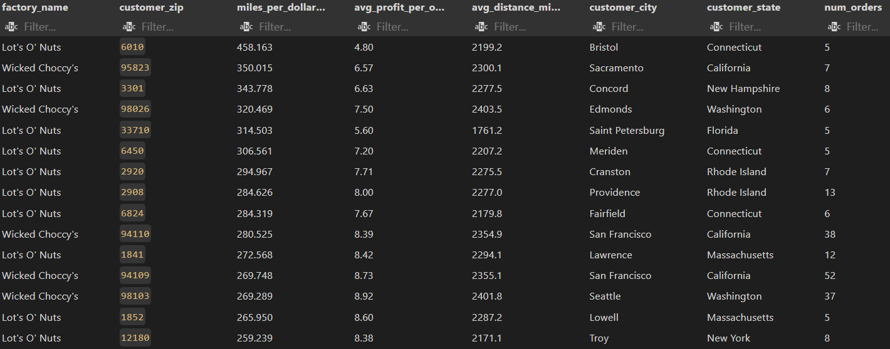

💡 Key Insights

Bristol (CT) route: ~2,200 mi for every $1 profit—unsustainable without intervention.

 
West Coast (Sacramento, Edmonds) and Northeast (Concord, Bristol) dominate the top inefficiencies.

 
Many flagged routes have only 5–8 orders—fixed costs and distance overhead hit small batches hardest.

Data Driven Decision 

 

Distance-Based Surcharges 💸

Introduce a tiered shipping fee for orders in the top “miles per $” buckets to preserve margin.

Order Consolidation Incentives 📦

Offer customers in remote ZIPs volume discounts or free-ship thresholds (e.g., $100 minimum) to increase per-order profit.

Carrier Rate Negotiations 🤝

Leverage route data to negotiate better zone rates or volume-based contracts on the worst-performing corridors.

Ongoing Monitoring 📊

Automate weekly “miles per $” reports with alerts when any route exceeds a defined threshold (e.g., 200 mi/$) for rapid action.

  
2. Which geographic regions deliver the highest return on sales (ROS)?
   ❓ Business Question: Meaning & Importance
 Importance:

🌎 Market Prioritization: Highlights markets with the healthiest margins.

📈 Investment Allocation: Guides where to concentrate marketing, inventory, and support resources.

⚖️ Strategic Balance: Balances growth (sales volume) against profitability.

```sql
-- Return-on-Sales (ROS) by Region
SELECT
  region,
  
  -- 1. Compute ROS = total gross profit ÷ total sales, rounded to 4 decimals
  ROUND(
    SUM(gross_profit)::numeric
    / NULLIF(SUM(total_sales), 0)::numeric
  , 4) AS ros,
  
  -- 2. Include total sales, profit, and volume for context
  SUM(total_sales)  AS total_sales,
  SUM(gross_profit) AS total_profit,
  SUM(units)        AS total_units_sold

FROM sales 

-- 3. Group by region to aggregate metrics region-wide
GROUP BY region

-- 4. Filter out any region with zero sales or very low volume
HAVING
     SUM(total_sales) > 0
 AND SUM(units)       >= 100

-- 5. Order by highest ROS and limit to top 10 regions
ORDER BY ros DESC
LIMIT 10;
```
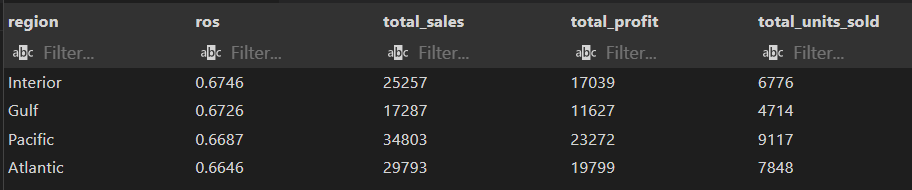

🚀 Key Insights

Interior Leads 🚩

Highest ROS (0.6746): each $1 of sales yields $0.67 profit—strong efficiency despite moderate volume.

Gulf & Pacific Close Behind 🥈

Both regions exceed 0.66 ROS, showing consistently healthy margins across diverse markets.

Atlantic Strength 🥉

Slightly lower ROS but robust sales and profit—opportunity to lift efficiency further.

📊 Business Implications
Profit Focus Over Volume: Regions like Gulf have fewer total sales than Pacific but deliver almost identical ROS—suggesting high-value customer segments.

Resource Leverage: High-ROS regions can absorb increased marketing spend with minimal margin dilution.

Underperformers (Outside Top 4): Regions not listed likely have ROS < 0.66—prime targets for cost reduction or pricing adjustments.

  Data_Driven_Decision"
  
  Scale High-ROS Markets 🚀

Increase promotional budgets in Interior and Gulf to drive incremental volume while maintaining strong margins.

Margin Improvement Plans 🛠

For Atlantic, analyze product mix and channel costs to push ROS toward Pacific levels.

Targeted Pricing Tests 💸

Pilot dynamic pricing in lower-ROS regions (e.g. Midwest, Northeast) to identify optimal price-profit sweet spots.

Optimize Channel Mix 📣

Shift direct-to-consumer vs. wholesale balance in high-ROS regions to magnify margin gains.

**Time-Based Trends**

1. How do monthly/quarterly sales trends look?
 
```sql
 --- A. Monthly Sales & Profit Trends (last 24 months)
WITH monthly AS (
  SELECT
    -- A. Determine the first day of each month for grouping
    DATE_TRUNC('month', order_date)::date AS period_start,
    -- B. Sum up the key metrics for that month
    SUM(total_sales)   AS sales,
    SUM(gross_profit)  AS profit,
    SUM(units)         AS units_sold
  FROM sales
  GROUP BY DATE_TRUNC('month', order_date)
  ORDER BY period_start
)
SELECT
  period_start,
  sales,
  profit,
  units_sold
FROM monthly
-- 3. Filter to most recent 24 months
WHERE period_start >= (DATE_TRUNC('month', NOW())::date - INTERVAL '24 months');

```
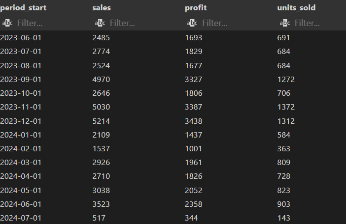

```sql

-- B. Quarterly Sales & Profit Trends (last 8 quarters = last 2 years =last 24 months)
WITH quarterly AS (
  SELECT
    -- 1. Truncate order_date to first day of quarter
    DATE_TRUNC('quarter', order_date)::date AS period_start,
    -- 2. Aggregate core metrics
    SUM(total_sales)   AS sales,
    SUM(gross_profit)  AS profit,
    SUM(units)         AS units_sold
  FROM sales
  GROUP BY DATE_TRUNC('quarter', order_date)
  ORDER BY period_start
)
SELECT
  period_start,
  sales,
  profit,
  units_sold
FROM quarterly
-- 3. Filter to most recent 8 quarters
WHERE period_start >= (DATE_TRUNC('quarter', NOW())::date - INTERVAL '24 months');
```
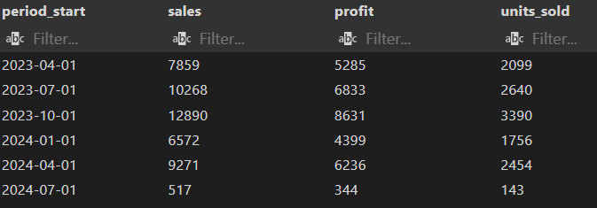

Key Insights
📊 Monthly Trends (Jun ’23–Jul ’24)
Holiday Spikes: Sep ’23, Nov ’23, Dec ’23 show 2×–3× lifts in sales & profit vs. adjacent months.

Post-Holiday Slump: Jan ’24–Feb ’24 dip (~40% drop in sales from Dec), then gradual recovery in Mar–Jun ’24.

Summer Slowdown: Jul ’24 has lowest volume (143 units), likely seasonal.

🌐 Quarterly Trends (Q2 ’23–Q3 ’24)
Q4 Peaks: Q4 ’23 highest—$12.9 K sales, $8.6 K profit, 3.4 K units.

Q1 Slump: Q1 ’24 drops ~49% in sales vs. Q4.

Q2 Rebound: Q2 ’24 recovers ~42% vs. Q1.


DDD" Data_Driven_Decision"

Pre-Holiday Ramp-Up:

Stock early and launch promotions in Sep–Oct to maximize holiday surge. 🎄

Post-Holiday Recovery Programs:

In Jan–Feb, deploy “New Year Deals” to soften the slump. 🌟

Summer Engagement:

Run limited-time “Summer Treat” bundles in Jul–Aug to counteract low season. ☀️

Quarterly Review Cadence:

Hold strategy check-ins each quarter-end to adjust forecasts and budgets based on latest trends. 🔄


   
2. Which weekdays vs weekends drive the most orders and profit?

```sql
-- Day-of-Week & Weekend vs. Weekday Metrics
WITH day_metrics AS (
  SELECT
    -- 1. Name of the weekday (e.g. Monday, Tuesday)
    TO_CHAR(order_date, 'FMDay') AS day_name,

    -- 2. Classify as “Weekend” if Saturday '6'/Sunday'0', otherwise “Weekday”
    CASE
      WHEN EXTRACT(DOW FROM order_date) IN (0,6) THEN 'Weekend'
      ELSE 'Weekday'
    END AS day_type,

    -- 3. Aggregate counts and dollar metrics
    COUNT(*)           AS num_orders,
    SUM(total_sales)   AS total_sales,
    SUM(gross_profit)  AS total_profit

  FROM sales
  GROUP BY
    TO_CHAR(order_date, 'FMDay'),
    CASE
      WHEN EXTRACT(DOW FROM order_date) IN (0,6) THEN 'Weekend'
      ELSE 'Weekday'
    END
)

SELECT
  day_name,
  day_type,
  num_orders,
  total_sales,
  total_profit,

  -- 4. Percentage of total orders by day
  ROUND(100.0 * num_orders / SUM(num_orders)    OVER (), 1) AS pct_of_orders,

  -- 5. Percentage of total profit by day
  ROUND(100.0 * total_profit / SUM(total_profit) OVER (), 1) AS pct_of_profit

FROM day_metrics

-- 6. Order rows Monday → Sunday
ORDER BY
  CASE day_name
    WHEN 'Monday'    THEN 1
    WHEN 'Tuesday'   THEN 2
    WHEN 'Wednesday' THEN 3
    WHEN 'Thursday'  THEN 4
    WHEN 'Friday'    THEN 5
    WHEN 'Saturday'  THEN 6
    WHEN 'Sunday'    THEN 7
  END;
```


💡 Key Insights
Mid-Week Leaders:

Tuesday (17.5 % orders, 17.3 % profit) and Monday (16.7 %/16.8 %) are your busiest weekdays.

Weekend Strength:

Sunday nearly matches Tuesday in both volume (17.4 %) and profit (17.6 %).

Saturday holds a solid 13.3 % of orders and 12.9 % of profit—strong weekend engagement.

Thursday & Friday Lulls:

Orders dip sharply on Thursday (9.2 %) and Friday (9.9 %), indicating mid-week troughs.


DDD" Data_Driven_Decision"
Optimize Staffing & Fulfillment 🏭

Schedule peak teams on Tuesdays, Sundays, and Mondays; assign lower headcount for Thursday–Friday maintenance.

Promotional Cadence 🎯

Launch “Mid-Week Boost” campaigns on Thursdays to smooth demand; highlight weekend flash sales on Saturdays.

Email & Ad Timing ✉️

Send targeted email blasts on Mondays and Sundays when open-rates and conversion potential are highest.

Weekend Incentives 🛍️

Offer “Weekend-Only” bundles or free-ship thresholds to capitalize on strong Saturday/Sunday traffic.

**Advanced Questions**

1.Who are our highest–lifetime–value customers, and how do they ship?
```sql
-- 1. Aggregate per customer and shipping mode
WITH customer_totals AS (
  SELECT
    customer_id,
    ship_mode,
    COUNT(*)          AS num_orders,      -- total orders placed
    SUM(total_sales)   AS total_sales,    -- total revenue generated
    SUM(gross_profit)  AS total_profit,   -- total gross profit earned
    SUM(units)         AS total_units     -- total units purchased
  FROM sales
  GROUP BY
    customer_id,
    ship_mode
),

-- 2. Rank customers by lifetime spend
ranked_customers AS (
  SELECT
    customer_id,
    ship_mode,
    num_orders,
    total_sales,
    total_profit,
    total_units,
    ROW_NUMBER() OVER (
      ORDER BY total_sales DESC          -- Rank highest-spending first
    ) AS customer_rank
  FROM customer_totals
)

-- 3. Retrieve the top five
SELECT
  customer_id,
  customer_rank,
  total_sales,
  total_profit,
  num_orders,
  total_units,
  ship_mode
FROM 
    ranked_customers
ORDER BY 
  customer_rank
 LIMIT 10;
```
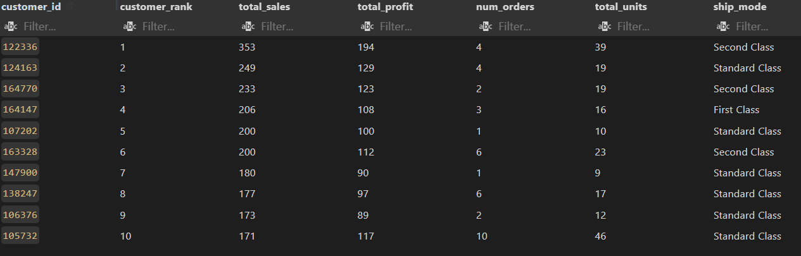

3️⃣ Business Value
Prioritize High-Value Relationships: Focus marketing and service on customers generating the most revenue.

Optimize Shipping Offers: Tailor shipping incentives (e.g., free upgrades) based on the ship_mode preferences of top customers.

Inform Loyalty Tiers: Structure rewards and benefits around actual spend bracket

key insights 
Modest Top Spend: The leading customer’s lifetime spend is $353—suggesting a relatively small dataset or early-stage business.

Shipping Preferences:

Second Class dominates among top spenders (ranks 1 & 3), indicating cost-sensitive but reliable delivery choices.

First Class appears for rank 4—potential for premium shipping offers.

Order Frequency vs. Spend:

Customer 122336 made 4 orders totaling $353, averaging $88/order (high AOV).

Customer 107202 made a single order (AOV $200), signaling occasional big-ticket purchases.

DDD" Data_Driven_Decision"

Launch Tiered Loyalty:

Offer “Second Class” shipping credits to top 5 customers to reinforce their preferred mode.

Promote Premium Options:

For customers using Standard/Second Class, market occasional First Class upgrades as paid add-ons.

Personalized Outreach:

Send VIP thank-you notes or small freebies to top 10 segment to boost retention and referrals.

Upsell Bundles:

Craft bundle deals aligned with average order values ($80–$200) to encourage slightly higher-frequency purchases.

   
2. How has gross profit for each product division evolved year-over-year?

❓ Business Question: Meaning & Importance
“How has gross profit for each product division evolved year-over-year?”

Meaning: Tracks the annual performance trends of Chocolate, Other, and Sugar lines.

Importance:

📈 Growth Diagnostics: Identifies which divisions are accelerating or stalling.

🔍 Risk Detection: Flags sudden profit declines needing immediate action.

🎯 Resource Allocation: Guides investment toward high-momentum categories
 ```sql
-- 1. Aggregate gross profit by division and year
WITH division_yearly AS (
  SELECT
  division,
    EXTRACT(YEAR FROM order_date)::int    AS order_year,    -- calendar year                            -- product category
    SUM(gross_profit)            AS total_profit   -- total yearly profit
  FROM sales 
  
  GROUP BY
  division,
    EXTRACT(YEAR FROM order_date)
    
),

-- 2. Compute prior-year profit for each division
division_trends AS (
  SELECT
    division,
    order_year,
    total_profit,
    LAG(total_profit) OVER (
      PARTITION BY division                    -- reset lag per category
      ORDER BY order_year                      -- chronological order
    ) AS prev_year_profit
  FROM division_yearly
)

-- 3. Final: year-over-year change and percent change
SELECT
  division,
  order_year,
  total_profit,
  prev_year_profit,
  (total_profit - prev_year_profit)        AS change_in_profit,    -- absolute diff
  ROUND(
    (total_profit - prev_year_profit)::numeric
    / NULLIF(prev_year_profit, 0)::numeric
  , 4)                                      AS pct_change            -- relative diff
FROM division_trends
WHERE prev_year_profit IS NOT NULL         -- exclude the first year (no prior data)
ORDER BY
  division,
  order_year;
```
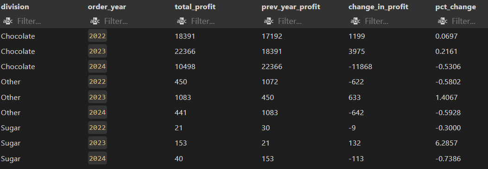

💡 Key Insights
Chocolate Roller-Coaster 🎢

Strong growth in 2023 (+21.6 %), then a dramatic drop in 2024 (−53 %).

Suggests either a one-off disruption (supply, pricing) or market saturation.

Other & Sugar Volatility ⚖️

Both divisions spike in 2023 (Other +141 %, Sugar +629 %), then plummet in 2024 (≈−58 % & −74 %).

Points to promotional or seasonal campaigns that weren’t sustained.

No Steady Winner 🚩

Every division experienced a sharp downturn in 2024—indicative of a company-wide headwind (e.g., cost inflation, competitive pressure).

DDD" Data_Driven_Decision"

Investigate 2024 Decline 🔍

Perform root-cause analysis: pricing changes, supply chain issues, or competitor actions.

Stabilize Promotions 📆

If 2023 spikes were driven by discounts, plan a sustainable promotion calendar rather than one-off deals.

Diversify Offerings 🌱

Develop new SKUs or bundles in Chocolate to reignite growth and buffer against category swings.

Margin Protection 💸

Review cost structures in 2024—negotiate raw-material contracts or adjust pricing to recover lost profit.


3. Which product lines should be moved to a different factory to optimize shipping routes?
Meaning: Compares each division’s current fulfillment site against the closest alternative to quantify shipping-distance savings.

Importance:

🚚 Logistics Efficiency: Shorter routes cut fuel, labor, and carrier costs.

⚖️ Margin Protection: Every mile saved boosts per-order profit.

📈 Network Optimization: Guides strategic decisions on factory assignments and micro-hub investments.
```sql
-- 1. Geo-encode each sale with division, origin factory, and customer coordinates
WITH sale_geo AS (
  SELECT
    p.division,                     -- product division/category
    f.factory_name,                 -- factory fulfilling the order
    f.latitude  AS fac_lat,         -- factory latitude
    f.longitude AS fac_lng,         -- factory longitude
    u.lat       AS cust_lat,        -- customer ZIP latitude
    u.lng       AS cust_lng         -- customer ZIP longitude
  FROM sales s
  JOIN products p
    ON s.product_id = p.product_id
  JOIN factories f
    ON p.factory_name = f.factory_name
  JOIN us_zips u
    ON s.postal_code = u.zip
),

-- 2. Calculate average shipping distance per division and factory
div_fac_dist AS (
  SELECT
    division,
    factory_name,
    AVG(
      3959 * acos(                  -- Haversine formula: miles between two lat/longs
        cos(radians(fac_lat))
        * cos(radians(cust_lat))
        * cos(radians(cust_lng) - radians(fac_lng))
        + sin(radians(fac_lat))
        * sin(radians(cust_lat))
      )
    ) AS avg_distance_miles
  FROM sale_geo
  GROUP BY division, factory_name
),

-- 3. Rank factories by their average distance for each division
ranked AS (
  SELECT
    division,
    factory_name,
    avg_distance_miles,
    ROW_NUMBER() OVER (
      PARTITION BY division           -- reset ranking within each product division
      ORDER BY avg_distance_miles     -- closest factory = rank 1
    ) AS rank_by_distance
  FROM div_fac_dist
)

-- 4. Identify sub-optimal factories and their optimal alternative
SELECT
  d1.division,
  d1.factory_name                         AS current_factory,
  ROUND(d1.avg_distance_miles::numeric, 1) AS current_avg_miles,

  -- **Add this** to show the name of the closest factory
  d2.factory_name                         AS optimal_factory,
  ROUND(d2.avg_distance_miles::numeric, 1) AS optimal_avg_miles,

  ROUND(
    (d1.avg_distance_miles - d2.avg_distance_miles)::numeric
  , 1)                                     AS miles_saved

FROM ranked AS d1
JOIN ranked AS d2
  ON d1.division        = d2.division
 AND d2.rank_by_distance = 1               -- pick the closest factory
WHERE d1.rank_by_distance > 1              -- exclude the already-optimal
ORDER BY miles_saved DESC;````
```
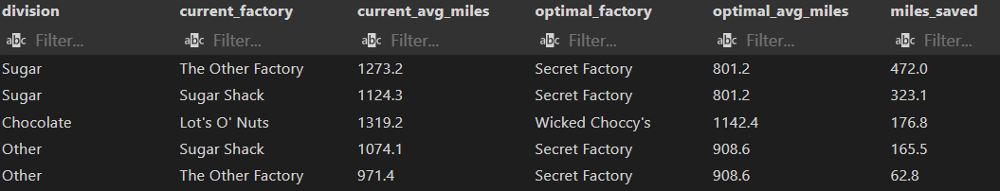


 key insights
 Sugar Division

Top Opportunity: Moving from The Other Factory → Secret Factory saves 472 miles/order.

Second Opportunity: Sugar Shack → Secret Factory saves 323 miles/order.

Chocolate Division

Lot’s O’ Nuts → Wicked Choccy’s yields 177 miles saved/order.

Other Division

Sugar Shack → Secret Factory saves 165.5 miles, and The Other Factory → Secret Factory saves 62.8 miles.

DDD" Data_Driven_Decision"

Pilot Relocation for Sugar 🍬

Shift Sugar production from The Other Factory to Secret Factory for immediate ~30% distance reduction.

Evaluate Chocolate Move 🍫

Test a small batch of Chocolate orders from Wicked Choccy’s to confirm service levels before full migration.

Consolidate “Other” Lines 🔗

Centralize “Other” SKUs at Secret Factory to capture both 165- and 62-mile savings.

Cost-Benefit Analysis 💸

Calculate per-order savings (miles × cost/mile) vs. migration/setup costs to prioritize roll-out.


Conclusion 📝
What I Learned 💡
 
Next Steps ⏭️
Contact 📬
